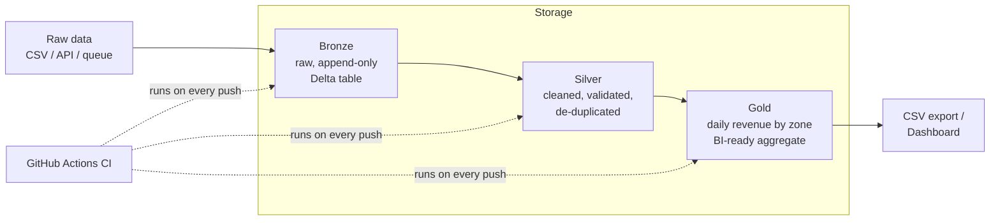

# Lakehouse Pipeline — Trip Analytics

A small but complete **Bronze → Silver → Gold** data lakehouse pipeline built
with **PySpark** and **Delta Lake**, runnable locally in Docker or on **Azure
Databricks / ADLS Gen2** with a single config change.

It ingests raw trip-record data (schema modeled on the public NYC TLC taxi
dataset), cleans and validates it, and produces a business-ready daily
revenue-by-zone aggregate — with automated tests and a CI pipeline that
runs the whole thing on every push.

## Why this project exists

I built this to work hands-on with the tools behind modern cloud data
platforms — PySpark, Delta Lake, and Azure — end to end: architecture,
pipeline code, orchestration, data quality, and CI/CD, not just individual
tutorials in isolation.

## Architecture



| Layer | Purpose | Key operations |
|---|---|---|
| **Bronze** | Raw, immutable copy of source data | Append-only, adds `_source_file` / `_ingested_at` metadata, schema-on-read |
| **Silver** | Cleaned, validated, conformed | Drops invalid/duplicate rows, type casting, adds `trip_date`, `trip_duration_minutes` |
| **Gold** | Business-ready aggregates | Daily revenue, trip count, and avg. duration per zone; exported to flat CSV for BI tools |

On top of the pipeline, a small **FastAPI** service exposes the Gold aggregate
as a JSON API, and a **Vue.js 3** dashboard consumes it — KPI cards, a daily
revenue trend, and a revenue-by-zone breakdown, filterable by zone.


Storage is abstracted behind `resolve_table_path()` in
[`src/utils/spark_session.py`](src/utils/spark_session.py) — switching from
local disk to Azure Data Lake Storage Gen2 is a one-line config change (see
[Running on Azure](#running-on-azure-databricks--adls-gen2) below), no
pipeline code changes required.

## Project structure

```
lakehouse-pipeline/
├── config/config.yaml           # storage mode, table names, data-quality thresholds
├── src/
│   ├── ingestion/generate_sample_data.py   # synthetic trip data (no external downloads needed)
│   ├── bronze/ingest_to_bronze.py          # raw ingestion
│   ├── silver/clean_transform.py           # cleaning & validation
│   ├── gold/aggregate.py                   # business aggregates
│   └── utils/spark_session.py              # Spark/Delta session + storage path resolver
├── tests/test_transformations.py           # pytest unit tests for the Silver logic
├── api/
│   ├── main.py                             # FastAPI service serving the Gold aggregate
│   └── requirements.txt
├── frontend/                               # Vue.js 3 + Vite dashboard (Chart.js)
│   └── src/
│       ├── App.vue
│       ├── api.js
│       └── components/
├── .github/workflows/ci.yml                # CI: tests + full pipeline smoke test
├── docker-compose.yml                      # local Spark + Delta + Jupyter environment
└── requirements.txt
```

## Quickstart (local, no cloud account needed)

```bash
docker compose up
```

This starts a Jupyter/PySpark container at `http://localhost:8888`. From a
terminal inside the container (or locally with `pip install -r
requirements.txt` and Java 17 installed):

```bash
# 1. Generate a synthetic sample dataset (~50k rows)
python src/ingestion/generate_sample_data.py --rows 50000 --out data/raw

# 2. Run the pipeline, layer by layer
python src/bronze/ingest_to_bronze.py
python src/silver/clean_transform.py
python src/gold/aggregate.py

# 3. Inspect the result
cat data/lake/exports/daily_zone_revenue.csv
```

## Dashboard (FastAPI + Vue.js)

`docker compose up` also starts the API (`:8000`) and the dashboard
(`:5173`) alongside the Spark/Jupyter container — useful once the pipeline
has run at least once. For local iteration without Docker, run them
directly in two terminals:

```bash
# Terminal 1 — API (http://localhost:8000, docs at /docs)
pip install -r api/requirements.txt
uvicorn api.main:app --reload --port 8000

# Terminal 2 — Dashboard (http://localhost:5173)
cd frontend
npm install
npm run dev
```

The dashboard shows total trips/revenue/tips, a daily revenue trend, and a
revenue-by-zone breakdown, filterable by zone. After a fresh pipeline run,
call `POST /api/refresh` (or just restart uvicorn) to pick up new data
without redeploying anything.

## Running the tests

```bash
pytest tests/ -v
```

Tests run against a local, in-memory Spark session and don't touch the data
lake — they validate the cleaning/validation rules in isolation (see
`tests/test_transformations.py`).

## Running on Azure Databricks + ADLS Gen2

The pipeline code is storage-agnostic. To point it at Azure instead of
local disk:

1. Set `storage.mode: azure` in `config/config.yaml` and fill in your
   storage account/container.
2. Set environment variables (or Databricks secret scope):
   `AZURE_STORAGE_ACCOUNT`, `AZURE_STORAGE_KEY`.
3. Run the same three scripts — on a Databricks cluster, as a Databricks
   Job, or via `spark-submit` — no code changes needed.

For production, `src/bronze/ingest_to_bronze.py` would be swapped to pull
from the real source system (API, queue, or the public NYC TLC dataset)
instead of `generate_sample_data.py`; everything downstream is unaffected
since it only depends on the raw CSV schema.

## Roadmap

- [ ] Orchestrate with Databricks Workflows / Airflow instead of manual script order
- [ ] Add Great Expectations for declarative data-quality checks in Silver
- [ ] Partition pruning + Z-ordering on the Gold table for query performance
- [ ] Cost-monitoring notes for the Azure deployment

## License

MIT
